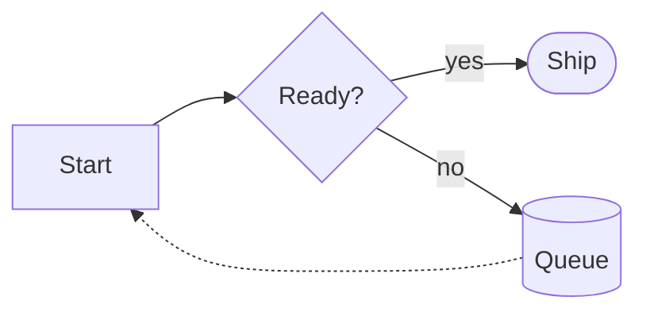

# serve-md

A minimal, zero-framework **static file server** with first-class Markdown
and HTML rendering. Every file in the served directory is reachable at its
real path — `index.html`, `style.css`, `favicon.ico`, images, video, `.md`
docs, all of it. `.md` and `.html` files additionally render as a clean,
reader-friendly page for browsers and plain text for `curl`/`wget`, with
optional HTTP Basic auth. Ships as a single **statically linked** binary with
no runtime dependencies — not even libc — and builds from just one crate
(`comrak`); the plugins, template engine, HTML tokenizer, base64 and
percent-encoding are all hand-rolled.

## Features

- **Static file server**: any file under the served directory is served at
  its real path (`GET /style.css`, `GET /images/logo.png`, `GET
  /favicon.ico`, ...) with a guessed `Content-Type`, byte-for-byte.
- **Index resolution**: `GET /` (or any directory path, e.g. `GET /docs`)
  tries `index.html`, then `index.md`, in that directory; if neither exists,
  it falls back to a recursive listing of every file in the served tree.
- **Canonical URLs**: every page has exactly one address, and the other
  spellings `301` to it — `/docs/index.md` and `/docs/index.html` redirect to
  `/docs`, a trailing slash is dropped (`/docs/` -> `/docs`, the root stays
  `/`), and repeated slashes collapse (`//docs///b.md` -> `/docs/b.md`). Query
  strings are carried across. An `index.md` shadowed by an `index.html` next
  to it stays reachable at its own explicit URL.
- **Markdown & HTML rendering**: requesting `.md`/`.markdown` or
  `.html`/`.htm` files directly negotiates format —
  - Browser: Markdown renders to HTML (GFM tables, strikethrough, autolinks,
    task lists); HTML files are served as-is.
  - Terminal (`curl`/`wget` user agent): Markdown renders to reader-friendly
    ASCII (wrapped paragraphs, underlined headings, ASCII tables, indented
    lists/code blocks); HTML gets its tags stripped with block-aware line
    breaks.
  - `Accept: text/markdown` or `Accept: text/plain` on **any** `.md`/`.html`
    request forces that format regardless of user agent — Markdown source,
    or converted plain text, respectively.
- **Render plugins**: opt-in extensions to the Markdown pipeline, selected
  with `--plugin <NAME>`. Nothing is enabled by default. Currently ships
  `math` and `mermaid` — see below.
- Recursively skips `.git`, `target`, `node_modules`, and friends when
  listing or resolving files.
- Optional HTTP Basic auth via `--user`/`--pass` (constant-time check).
- Path-traversal safe: requests are validated and resolved strictly under the
  served directory.

## Usage

```
serve-md 0.4.0
A minimal web server that lists and renders Markdown and HTML files.

USAGE:
    serve-md [OPTIONS]

OPTIONS:
        --host <HOST>      Address to bind to            [default: 127.0.0.1]
        --port <PORT>      Port to listen on             [default: 8080]
        --dir <DIR>        Directory to serve            [default: .]
        --user <USER>      Require Basic auth username
        --pass <PASS>      Password for --user (or env SERVE_MD_PASSWORD)
        --no-open          Do not open a browser on startup
        --verbose          Log each request to stdout
        --plugin <NAME>    Enable a render plugin (repeatable or comma-separated;
                           none are enabled by default)
    -h, --help             Print help
    -V, --version          Print version

PLUGINS:
    math — render LaTeX math as MathML
    mermaid — render mermaid flowcharts as inline SVG

EXAMPLES:
    serve-md
    serve-md --host 0.0.0.0 --port 9000 --dir ./docs
    serve-md --plugin math --dir ./docs
    serve-md --plugins math,mermaid --dir ./docs
    serve-md --user admin --pass secret
    curl -u admin:secret http://127.0.0.1:8080/README.md
```

`--pass` is optional when `SERVE_MD_PASSWORD` is set in the environment.

## Plugins

Render plugins are compiled into the binary and enabled by name. They are
**off by default**, so plain `serve-md` renders exactly the CommonMark it
always has. `--plugin` is repeatable, and an unknown name is rejected at
startup rather than silently ignored:

```
$ serve-md --plugin math --dir ./docs
$ serve-md --plugins math,mermaid --dir ./docs
$ serve-md --plugin nope
error: unknown plugin: nope (available: math, mermaid)
```

`--plugin` and `--plugins` are the same switch; names may be repeated or
comma-separated.

### `math` — LaTeX formulas

Renders math **entirely on the server** into [MathML][mathml], which every
current browser typesets natively. No JavaScript is served, no stylesheet or
web font is fetched from a CDN, and the rendered page works with scripting
disabled. The LaTeX-to-MathML converter is written from scratch — a
recursive-descent parser over a practical subset — so this costs no
dependencies. Four syntaxes are recognised:

| Markdown              | Renders as       |
| --------------------- | ---------------- |
| `$E = mc^2$`          | inline math      |
| `$$E = mc^2$$`        | display math     |
| `` $`E = mc^2`$ ``    | inline math      |
| ` ```math ` fence     | display math     |

| Supported | Notes |
| --------- | ----- |
| Scripts | `x^2`, `x_i`, `x_i^2`, braced groups `x^{10}` |
| Fractions and roots | `\frac`, `\dfrac`, `\tfrac`, `\sqrt`, `\sqrt[n]` |
| Big operators | `\sum`, `\prod`, `\int`, `\oint`, `\bigcup`, `\lim`, … — limits stack above/below in display mode, beside in inline |
| Delimiters | `\left(` … `\right)`, including `[`, `\{`, `\langle`, `\lceil`, `\lfloor`, `\left.` |
| Text and fonts | `\text`, `\mathrm`, `\mathbf`, `\mathbb`, `\mathcal`, `\mathsf`, `\mathtt`, `\mathfrak` |
| Functions | `\sin`, `\cos`, `\log`, `\exp`, `\det`, … set upright |
| Symbols | ~150: Greek, relations, arrows, set theory, `\infty`, `\partial`, `\nabla`, … |
| Spacing | `\,`, `\;`, `\!`, `\quad`, `\qquad` |

**Not supported**: matrices and `\begin{…}` environments, alignment (`&`, `\\`),
macro definitions, and colour. A formula using them fails to parse and is left
as visible LaTeX source rather than rendered wrong.

The original LaTeX is preserved inside the MathML as an
`<annotation encoding="application/x-tex">`, so formulas stay copy-pasteable
and readable to screen readers.

Terminal and `Accept: text/markdown` clients receive the LaTeX source with its
delimiters intact, so `curl` output can be pasted straight back into a `.md`
file.

[mathml]: https://developer.mozilla.org/en-US/docs/Web/MathML

### `mermaid` — flowcharts

Mermaid is a JavaScript library; this is a from-scratch renderer for the
**flowchart** subset of its syntax, so diagrams arrive already drawn and the
page ships no script. A ```` ```mermaid ```` fence is parsed into a graph, laid
out with a layered (Sugiyama-style) algorithm — longest-path ranking over the
DAG left after cycle-closing edges are set aside, then median-heuristic
crossing reduction — and written out as inline SVG that scales with the page
and follows the reader's light/dark preference.

````

````

| Supported | Notes |
| --------- | ----- |
| `flowchart` / `graph` | directions `TD`, `TB`, `BT`, `LR`, `RL` |
| Node shapes | `[rect]`, `(round)`, `([stadium])`, `((circle))`, `{diamond}`, `{{hexagon}}`, `[[subroutine]]`, `[(cylinder)]` |
| Link styles | `-->`, `---`, `-.->`, `-.-`, `==>`, `===` |
| Edge labels | `A -->\|label\| B` |
| Other | `%%` comments, `;` separators, chains (`A --> B --> C`), self-loops, cycles |

**Not supported**, by design — anything unrecognised is left as a plain code
block rather than rendered wrong: subgraphs, other diagram types (sequence,
class, state, gantt, pie, ...), `<br/>` inside labels, and the `-- label -->`
inline label form. `style`/`classDef`/`class`/`click` statements are skipped.

Because there is no font engine, label widths are computed from a built-in
Helvetica/Arial metrics table, which is what the SVG's font stack resolves to
on virtually every platform.

### Adding a plugin

Implement the `Plugin` trait in `src/plugin/` and add one line to `REGISTRY`
in [`src/plugin/mod.rs`](src/plugin/mod.rs). The trait offers three hooks:
`configure` (turn on parser extensions), `transform` (rewrite the AST before
HTML rendering), and `head` (contribute `<head>` markup, emitted only on pages
the plugin actually changed).

## Terminal examples

```
# list files (or serve index.html/index.md if present)
$ curl http://127.0.0.1:8080/

# view a markdown file (rendered to ASCII: wrapped text, tables, headings)
$ curl http://127.0.0.1:8080/docs/guide.md

# force raw markdown source regardless of client
$ curl -H 'Accept: text/markdown' http://127.0.0.1:8080/docs/guide.md

# with --plugin math, formulas reach terminals as LaTeX and browsers as MathML
$ curl http://127.0.0.1:8080/notes.md | grep 'E = mc'
The identity $E = mc^2$ links mass and energy.

# diagrams stay readable as source in a terminal, and render as SVG in a browser
$ curl -H 'Accept: text/markdown' http://127.0.0.1:8080/design.md

# static assets are served as-is
$ curl http://127.0.0.1:8080/favicon.ico -o favicon.ico
```

## Install

Download a binary from [releases][releases] and run it — there is nothing to
install alongside it.

| Binary | Target | Requires |
| ------ | ------ | -------- |
| `serve-md-linux-x86_64` | `x86_64-unknown-linux-musl` | any Linux kernel; **no glibc, no shared libraries** |
| `serve-md-linux-aarch64` | `aarch64-unknown-linux-musl` | any ARM64 Linux kernel; same |
| `serve-md-windows-x86_64.exe` | `x86_64-pc-windows-msvc` | no Visual C++ redistributable (the CRT is linked in) |

The Linux builds target musl and are fully static, so they run on old
distributions regardless of the glibc version installed — a dynamically linked
build made on a current runner would refuse to start on anything older than the
machine that produced it. CI asserts this on every release: a binary carrying a
`NEEDED` entry or a program interpreter fails the build.

[releases]: https://github.com/tayyebi/serve-md/releases

## Build

```
cargo build --release
```

For a static Linux binary matching the released ones:

```
rustup target add x86_64-unknown-linux-musl
cargo build --release --target x86_64-unknown-linux-musl
```

GitHub Actions runs `clippy`, tests and a release build on every push. Pushing a
`v*` tag builds the release binaries and attaches them to a GitHub release; the
same workflow can be run manually from the Actions tab to test a build without
tagging.

```
git tag v0.4.0
git push origin v0.4.0
```

## License

MIT
